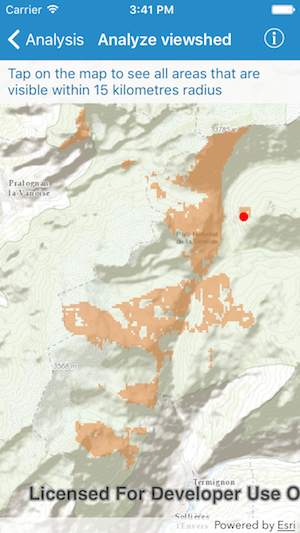

# Viewshed (Geoprocessing)

This sample demonstrates how to calculate a viewshed using a geoprocessing service.

## How to use the sample

Tap anywhere on the map to see all areas that are visible within 15 kilometers radius.

## How it works

An `AGSGeoprocessingTask` with the URL set to the REST endpoint of a geoprocessing service is created. Once the graphic is added to the Map, an `AGSFeatureCollectionTable` is created, a new `AGSFeature` is added from the graphic's location into the featureCollectionTable, and new `AGSGeoprocessingParameter`s are created using the featureCollectionTable. Next, an `AGSGeoprocessingJob` is created from the geoprocessingTask by passing in the parameters. Once the job completes successfully, an `AGSFeatureSet` is obtained from the `AGSGeoprocessingResult`, and the features from the featureSet are added to a `AGSGraphicsOverlay`.
