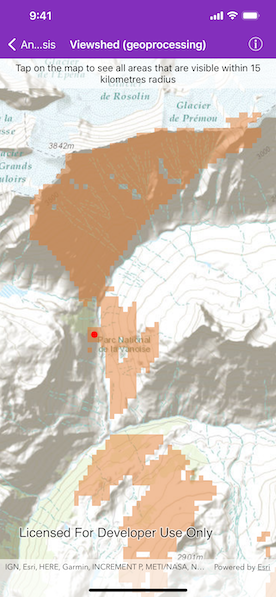

# Viewshed (Geoprocessing)

Calculate a viewshed using a geoprocessing service, in this case showing what parts of a landscape are visible from points on mountainous terrain.

## Use case

A viewshed is used to highlight what is visible from a given point. A viewshed could be created to show what a hiker might be able to see from a given point at the top of a mountain. Equally, a viewshed could also be created from a point representing the maximum height of a proposed wind turbine to see from what areas the turbine would be visible. 

## How to use the sample

Tap the map to see all areas visible from that point within a 15km radius. Tapping on an elevated area will highlight a larger part of the surrounding landscape. It may take a few seconds for the task to run and send back the results.

## How it works

1. Create an `AGSGeoprocessingTask` object with the URL set to a geoprocessing service endpoint.
2. Create an `AGSFeatureCollectionTable` object and add a new `AGSFeature` object whose geometry is the viewshed's observer `AGSPoint`.
3. Make an `AGSGeoprocessingParameters` object passing in the observer point.
4. Use the geoprocessing task to create an `AGSGeoprocessingJob` object with the parameters.
5. Start the job and wait for it to complete and return an `AGSGeoprocessingResult` object.
6. Get the resulting `AGSGeoprocessingFeatures` object.
7. Iterate through the viewshed features to use their geometry or display the geometry in a new `AGSGraphic` object.

## Relevant API

* AGSFeatureCollectionTable
* AGSGeoprocessingFeatures
* AGSGeoprocessingJob
* AGSGeoprocessingParameters
* AGSGeoprocessingResult
* AGSGeoprocessingTask

## Tags

geoprocessing, heat map, heatmap, viewshed
