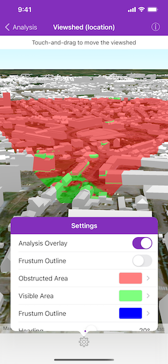

# Viewshed (location)

Perform a viewshed analysis from a defined vantage point. 

## Use case

A 3D viewshed analysis is a type of visual analysis you can perform on a scene. The viewshed shows what can be seen from a given location. The output is an overlay with two different colors - one representing the visible areas (green) and the other representing the obstructed areas (red). Viewshed analysis is a form of "exploratory analysis", which means the results are calculated on the current scale of the data, and the results are generated very quickly. If more "conclusive" results are required, consider using an `AGSGeoprocessingTask` to perform a viewshed instead.

## How to use the sample

Tap on the map to add an observer location. Tap the gear icon to view the settings. Use the sliders to change the properties (heading, pitch, etc.), of the viewshed and see them updated in real time. To move the viewshed, touch and drag your finger across the screen. Lift your finger to stop moving the viewshed.

## How it works

1. Create an `AGSLocationViewshed` passing in the observer location, heading, pitch, horizontal/vertical angles, and min/max distances.
2. Set the property values on the viewshed instance for location, direction, range, and visibility properties. 

## Relevant API

* AGSAnalysisOverlay
* AGSArcGISSceneLayer
* AGSArcGISTiledElevationSource
* AGSLocationViewshed
* AGSViewshed

## About the data

The scene shows a [buildings layer in Brest, France](https://tiles.arcgis.com/tiles/P3ePLMYs2RVChkJx/arcgis/rest/services/Buildings_Brest/SceneServer/layers/0) hosted on ArcGIS Online.

## Tags

3D, frustum, LocationViewshed, Scene, viewshed, visibility analysis
