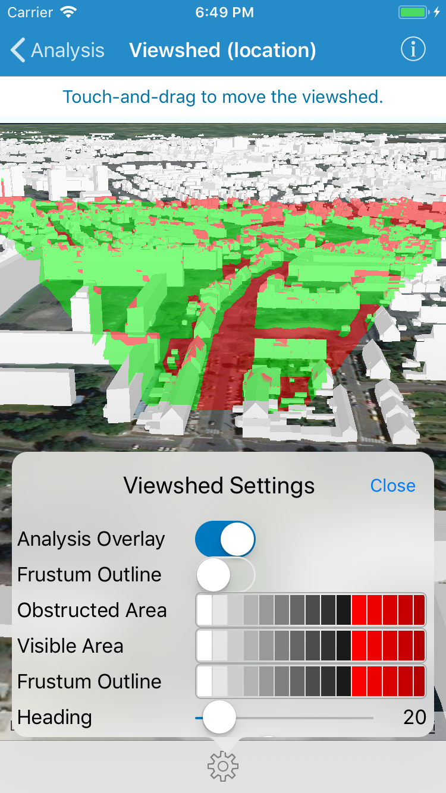

# Viewshed (location)

This sample demonstrates how to interactively edit a viewshed analysis in a scene and see updates on-the-fly.

## How it works

`AGSLocationViewshed` is initialized using the `init(location:heading:pitch:horizontalAngle:verticalAngle:minDistance:maxDistance)` method, which takes the observer location, heading, pitch, view angles, and distance range (in meters).

`AGSGeoViewTouchDelegate` is used for capturing user's interaction on map and updating the observer location. The observer location is set on the `geoView(_:didTapAtScreenPoint:mapPoint:)` method when user taps on map and on the  `geoView(_:didTouchDragToScreenPoint:mapPoint)` method when user performs touch and drag interaction on map. The touch and drag event is only raised if the `geoView:(_:didTouchDownAtScreenPoint:mapPoint:completion)` method has passed `true` to the completion block parameter.

The sample also provides a UI control from which user can update the values of direction and field of view properties. The heading, pitch, view angles, and distances are modified using the properties of the viewshed instance. On the other hand, the visible area color, obstructed area color, and frustum outline color are set using the static properties on the base class `AGSViewshed`. This setting is applied to all viewshed analyses in the view.
