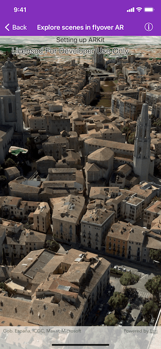

# Explore scenes in flyover AR

Use augmented reality (AR) to quickly explore a scene more naturally than you could with a touch or mouse interface.

## Use case

You can use AR to drop into an area and visualize information, like a proposed development or a historical model of a city. You could use flyover AR to explore a city by walking through it virtually.

## How to use the sample

When you open the sample, you'll be viewing the scene from above. You can walk around, using your device as a window into the scene. Try moving vertically to get closer to the ground.

## How it works

1. Create the `ArcGISARView` and add it to the view.
2. Listen for ARKit tracking state updates using `ArcGISARView.arSCNViewDelegate` and provide guidance to the user as necessary.
3. Create the scene, add content, then display it.
4. When the content you want to view loads, get its center point and use that to create the origin camera for the AR view. Note that the altitude should be set so that all scene content is visible. For a city, a good value might be a bit higher than the tallest building. The sample uses 600 meters in the absence of tall buildings in the sample data.
5. Set the translation factor so that you can move through the scene easily. With a translation factor of 1000, you will move 1000 feet in the scene for every foot you move the physical device.
6. Set the space effect to `stars` and atmosphere effect to `realistic` to create an immersive experience.

## Relevant API

* AGSSceneView
* ArcGISARView

## About the data

This sample uses an [integrated mesh](https://tiles.arcgis.com/tiles/z2tnIkrLQ2BRzr6P/arcgis/rest/services/Girona_Spain/SceneServer) that depicts the city of Girona, Spain and is attributed to the Institut Cartogràfic i Geològic de Catalunya (ICGC). The data was produced from [photogrammetrically correct imagery](https://pro.arcgis.com/en/pro-app/help/data/imagery/ortho-mapping-in-arcgis-pro.htm). Areas of white space within the integrated mesh are areas that had poor overlapping coverage from photos.

The [world elevation service](https://elevation3d.arcgis.com/arcgis/rest/services/WorldElevation3D/Terrain3D/ImageServer) is used to show terrain while the integrated mesh layer loads.

## Additional information

This sample requires a device that is compatible with ARKit 1.0 on iOS.

**Flyover AR** is one of three main patterns for working with geographic information in augmented reality. Augmented reality is made possible with the ArcGIS Runtime Toolkit. See [Augmented reality](https://developers.arcgis.com/ios/scenes-3d/display-scenes-in-augmented-reality/) in the guide for more information about augmented reality and adding it to your app.

## Tags

augmented reality, bird's eye, birds-eye-view, fly over, flyover, mixed reality, translation factor
