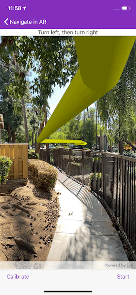

# Navigate in AR

Use a route displayed in the real world to navigate.

## Use case

It can be hard to navigate using 2D maps in unfamiliar environments. You can use full-scale AR to show a route overlaid on the real-world for easier navigation.

## How to use the sample

The sample opens with a map centered on the current location. Tap the map to add an origin and a destination; the route will be shown as a line.

When ready, tap the camera button to start the AR navigation. Calibrate the heading before starting to navigate.

When you start, route instructions will be displayed and spoken. As you proceed through the route, new directions will be provided until you arrive.

## How it works

1. The map page is used to plan the route before starting the AR experience. See *Navigate route*, *Find a route* and *Offline routing* samples for a more focused demonstration of that workflow.
2. Pass the resulting `AGSRouteResult` and the input `AGSRouteTask` and `AGSRouteParameters` to the view used for the AR navigation experience.
    * The route task and parameters are used to support a rerouting capability where routes are recalculated on-the-fly if you deviate. Due to service limitations, this sample doesn't support on-the-fly rerouting. You can incorporate offline routing to support rerouting in your app.
3. Start ARKit tracking with continuous location updates when the AR view is shown.
4. Get the route geometry from the first route in the `AGSRouteResult`. Use the scene's base surface to apply elevation to the line so that it will follow the terrain.
    1. First, densify the polyline to ensure that the elevation adjustment can be applied smoothly along the line with `class AGSGeometryEngine.densifyGeometry(_:maxSegmentLength:)`.
    2. Next, create a polyline builder with a spatial reference matching the input route geometry.
    3. Get a list of all points in the polyline by iterating through parts and points along each part.
    4. For each point in the polyline, use `AGSSurface.elevation(for:completion:)` to get the elevation for that point. Then create a new point with the *x* and *y* of the input and *z* as the returned elevation value. This sample adds 3 meters to that value so that the route line is visible above the road. Add the new point to the polyline builder.
    5. Once all points have been given an elevation and added to the polyline builder, call `AGSPolylineBuilder.toGeometry()` to get the elevation-adjusted route line.
5. Add the route geometry to a graphics overlay and add a renderer to the graphics overlay. This sample uses an `AGSMultilayerPolylineSymbol` with an `AGSSolidStrokeSymbolLayer` to visualize a tube along the route line.
6. Create a calibration view. This sample uses a slider to manipulate the heading (direction you are facing). Because of limitations in on-device compasses, calibration is often necessary; small errors in heading cause big problems with the placement of scene content in the world.
    1. Note that while this sample implemented a slider, there are many possible strategies for implementing heading calibration.
    2. While calibrating, the basemap is shown at 60% opacity, to allow you to compare the basemap imagery with what is seen by the camera. While this works in some environments, it won't work indoors, in forested areas, or if the ground truth has changed since the basemap imagery was updated. Alternative scenarios can involve orienting relative to landmarks (for example, stage sets at a concert) or starting at a known orientation by lining up with a static image.
    3. The slider in the sample implements a "joystick" interaction; the heading is adjusted faster the further you move from the center of the slider. There are many possible slider interactions you could choose to implement.
    4. The calibration view does not come up by default. It will pop up by tapping on the "Calibrate" button, and can be dismissed by tapping anywhere on the scene.
7. When the user starts navigating, create an `AGSRouteTracker`, providing an `AGSRouteResult` and the index of the route you want to use; this sample always picks the first returned result.
8. Create a location data source and listen for location change events. When the location changes, use `AGSLocationChangeHandlerDelegate` to get the updated location.
9. Keep the calibration view accessible throughout the navigation experience. As the user walks, small heading errors may become more noticeable and require recalibration.

## Relevant API

* AGSCLLocationDataSource
* AGSGeometryEngine
* AGSRouteResult
* AGSRouteTask
* AGSRouteTracker
* AGSSurface
* ArcGISARView

## About the data

This sample uses Esri's [World Elevation](https://elevation3d.arcgis.com/arcgis/rest/services/WorldElevation3D/Terrain3D/ImageServer) service to ensure that route lines are placed appropriately in 3D space. It uses Esri's [World Route](https://www.arcgis.com/home/item.html?id=1feb41652c5c4bd2ba5c60df2b4ea2c4) service to calculate routes. The world routing service requires authentication and does consume ArcGIS Online credits.

**Note:** This routing service requires one of the following authentication methods

* An ArcGIS Online organizational subscription and consumes credits
* An ArcGIS Developer account and consumes credits
* An API key

To access this sample with ArcGIS identity/named user login using OAuth workflow, please read more at [ArcGIS Identity](https://developers.arcgis.com/documentation/mapping-apis-and-services/security/arcgis-identity/).

The routing service can also be accessed with an API key, either specified in AppDelegate or in the sample. Please read more at [API keys](https://developers.arcgis.com/documentation/mapping-apis-and-services/security/api-keys/).

Learn more about [security and authentication on ArcGIS Developers website](https://developers.arcgis.com/documentation/mapping-apis-and-services/security/).

## Additional information

This sample requires a device that is compatible with ARKit 1 on iOS.

Unlike other scene samples, there's no need for a basemap while navigating, because context is provided by the camera feed showing the real environment. The base surface's opacity is set to zero to prevent it from interfering with the AR experience. During calibration, the basemap is shown with opacity to help the user verify that they have calibrated properly.

A digital elevation model is used to ensure that the displayed route is positioned appropriately relative to the terrain of the route. If you don't want to display the route line floating, you could show the line draped on the surface instead.

**World-scale AR** is one of three main patterns for working with geographic information in augmented reality.

Because most navigation scenarios involve traveling beyond the accurate range for ARKit positioning, this sample relies on **continuous location updates** from the location data source. Because the origin camera is constantly being reset by the location data source, the sample doesn't allow the user to pan to calibrate or adjust the altitude with a slider. The location data source doesn't provide a heading, so it isn't overwritten when the location refreshes.

This sample uses the ArcGIS Runtime Toolkit. See the section [Enable your app for AR using AR Toolkit](https://developers.arcgis.com/ios/scenes-3d/display-scenes-in-augmented-reality/) in the iOS Guide to learn about the toolkit and how to add it to your app.

## Tags

augmented reality, directions, full-scale, guidance, mixed reality, navigate, navigation, real-scale, route, routing, world-scale
