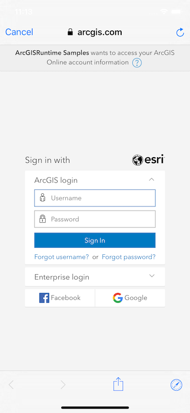
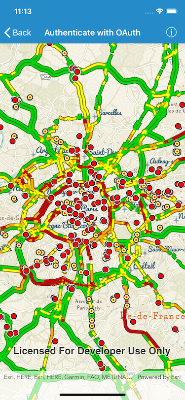

# Authenticate with OAuth

Authenticate with ArcGIS Online (or your own portal) using OAuth2 to access secured resources (such as private web maps or layers).

 

## Use case

Your app may need to access items that are only shared with authorized users. For example, your organization may host private data layers or feature services that are only accessible by verified users. You may also need to take advantage of premium ArcGIS Online services, such as geocoding or routing, that require a named user login.

## How to use the sample

When you run the sample, the app will load a web map which contains premium content. You will be challenged for an ArcGIS Online login to view the private layers. Enter a user name and password for an ArcGIS Online named user account (such as your ArcGIS for Developers account). If you authenticate successfully, the traffic layer will display, otherwise the map will contain only the public basemap layer.

## How it works

1. Create an `AGSOAuthConfiguration` specifying the portal URL, client ID, and redirect URL.
2. Add the OAuth configuration to the authentication manager.
3. Load a map with premium content requiring authentication to automatically invoke the default authentication manager.

## Relevant API

 * AGSAuthenticationManager
 * AGSOAuthConfiguration
 * AGSPortalItem

## Additional information

The workflow presented in this sample works for all SAML based enterprise (IWA, PKI, Okta, etc.) & social (facebook, google, etc.) identity providers for ArcGIS Online or Portal. For more information, see the topic [Set up enterprise logins].(https://doc.arcgis.com/en/arcgis-online/administer/enterprise-logins.htm).

For additional information on using Oauth in your app, see the topic [Authenticate with the API](https://developers.arcgis.com/documentation/core-concepts/security-and-authentication/mobile-and-native-user-logins/) in *Mobile and Native Named User Login*.

## Tags

authentication, cloud, credential, OAuth, portal, security
