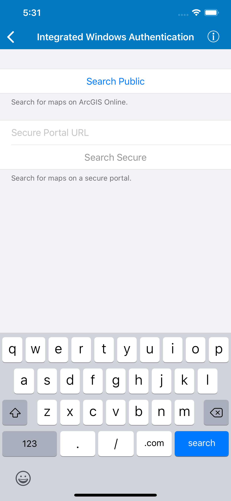

# Integrated Windows Authentication

Connect to an IWA secured Portal and search for maps.

## Use case

Your organization might use Integrated Windows Authentication (IWA) to secure ArcGIS Enterprise. This can be useful because the same credentials used to log into your work computer and network can be used to authenticate with ArcGIS. IWA is built into Microsoft Internet Information Server (IIS) and works well for intranet applications but isn't always practical for internet apps.

## How to use the sample

1. Enter the URL to your IWA-secured portal in the text field above the Search Secure button.
2. Tap either the Search Public button (which will search for portals on www.arcgis.com) or Search Secure button (which will search your IWA-secured portal), to search for web maps stored on the portal.
3. If you tap Search Secure, you will be prompted for a username (including domain, such as username@DOMAIN or domain\username) and password.
4. If you authenticate successfully, portal item results will display in the table view.
5. Tap a web map item to display it in a map view.

## Relevant API

* AGSPortal

## How it works

1. The `AGSAuthenticationManager` object is configured with a challenge handler that will prompt for a Windows login (username including domain, and password) if a secure resource is encountered.
2. When a search for portal items is performed against an IWA-secured portal, the challenge handler creates an `AGSCredential` object from the information entered by the user.
3. If the user authenticates, the search returns a list of web maps from `AGSPortalItem` objects and the user can select one to display as an `AGSMap`.

## About the data

This sample searches for web map portal items on a secure portal. To successfully run the sample, you need:

* Access to a portal secured with Integrated Windows Authentication that contains one or more web map items.
* A login that grants you access to the portal.

## Additional information

More information about IWA and its use with ArcGIS can be found at the following links:

* [IWA - Wikipedia](https://en.wikipedia.org/wiki/Integrated_Windows_Authentication)
* [Use Integrated Windows Authentication with your portal](http://enterprise.arcgis.com/en/portal/latest/administer/windows/use-integrated-windows-authentication-with-your-portal.htm)

## Tags

authentication, portal, security, Windows
