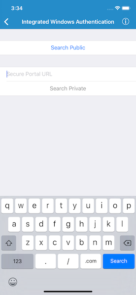

# Integrated Windows Authentication

Uses Windows credentials to access services hosted on a portal secured with Integrated Windows Authentication (IWA).

## Use case

IWA, which is built into Microsoft Internet Information Server (IIS), works well for intranet applications, but isn't always practical for internet apps.

## How to use the sample

1. Enter the URL to your IWA-secured portal in the text field above the Search Private button.
2. Tap either the Search Public button (which will search for portals on www.arcgis.com) or Search Secure button (which will search your IWA-secured portal), to search for web maps stored on the portal.
3. If you tap Search Secure, you will be prompted for a username (including domain, such as username@DOMAIN or domain\username) and password.
4. If you authenticate successfully, portal item results will display in the table view.
5. Tap a web map item to display it in a map view.

## How it works

1. The `AGSAuthenticationManager` object is configured with a challenge handler that will prompt for a Windows login (username including domain, and password) if a secure resource is encountered.
2. When a search for portal items is performed against an IWA-secured portal, the challenge handler creates an `AGSCredential` object from the information entered by the user.
3. If the user authenticates, the search returns a list of web maps from `AGSPortalItem` objects and the user can select one to display as an `AGSMap`.

## Relevant API

- `AGSAuthenticationManager`
- `AGSPortal`
- `AGSCredential`

## Tags

Cloud and Portal
