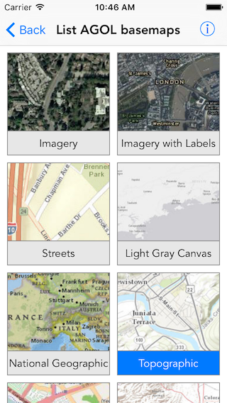

#List AGOL basemaps

The sample shows how to fetch basemaps from ArcGIS online without login and highlights the default basemap

##How it works

The sample instantiates a portal object using the `ArcGISOnlineWithLoginRequired:` factory method. It then uses the convenience method `fetchBasemapsWithCompletion:` to fetch basemaps from a portal. The basemaps are then populated into a collection view.

