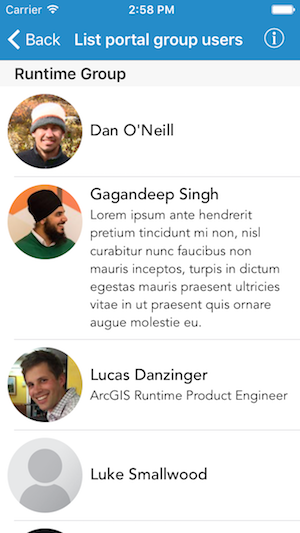

#List portal group users

This sample demonstrates how to show users in a portal group.

##How it works

The sample initializes an `AGSPortal` object. A group on this portal is retrieved using `findGroupsWithQueryParameters:completion:` method. From this group, all users are fetched using `fetchUsersWithCompletion:` method. The method returns an array of user names. An `AGSPortalUser` object is created for each user name using `initWithPortal:username:` initializer. Each of these portalUser object is loaded and the user information is shown in a table view.

