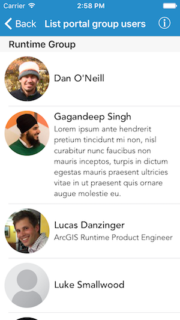

# List portal group users

Shows a list of users in a portal group.

## Use case

This portal information can be used to provide a customized UI experience for the user. For example, you can show a thumbnail next to their username in the header of an application to indicate that they are currently logged in. Additionally, apps such as Collector and Explorer use this functionality to integrate with Portal.

## How to use the sample

When launched, this sample displays a list of users in the Runtime Group portal. Notice that along with displaying each user's name and picture, their description is displayed as well. 

## How it works

1. Initialize an `AGSPortal` object.
2. Retrieve a group from this portal using `findGroups(with:completion:)`, which returns an array of user names.
3. Obtain all the users in this group by using `fetchUsers(completion:)`.
4. Create an `AGSPortalUser` object for each user name using `init(portal:username:)`.

## Relevant API

* AGSPortal
* AGSPortalGroup
* AGSPortalUser

## About the data

This sample displays users who are a part of the Runtime Group portal.

## Tags
account, cloud and portal, description, profile, user, username
