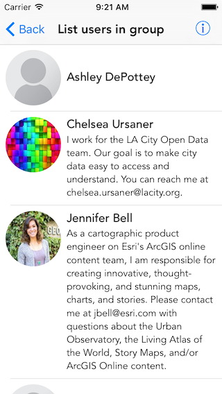

#List users in group

This sample demonstrates how to get information on users in a group.

##How it works

The sample uses the AGOL portal and a predefined group. It creates a portal object using `ArcGISOnlineWithLoginRequired:` factory method on `AGSPortal`. It then queries for the group using the group owner and title information via `findGroupsWithQueryParameters:completion:` method. Once it has the group it fetch the usernames of the users in that group by using `fetchUsersWithCompletion:` method on `AGSPortalGroup`. It then creates an `AGSPortalUser` object for each of the usernames using the `initWithPortal:username:` initializer on `AGSPortalUser`. Finally it displays the user information in table view.

