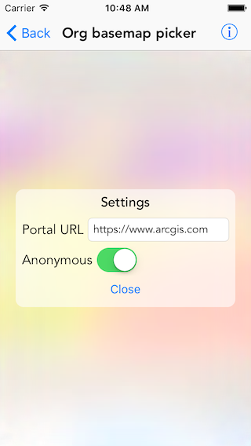

#Org basemap picker

The sample demonstrates how to fetch basemaps from an organization portal 

##How to use the sample

The sample loads with the settings view visible. Here you can configure the URL of your portal and choose if you want to login or not. Tap on the `Close` button to get map view with preloaded feature layer. Tap on the `Change basemap` button to get a list of basemaps from the portal. The list is set to fetch five basemaps at a time, if more are available you will see the add button cell in the end. Tap on that to get more basemaps. Tap on a basemap to select and apply that to the map view.

##How it works

The sample instantiates an `AGSPortal` object with the provided URL using `initWithURL:loginRequired:` initializer, also taking into account if login is required or not. It then gets the `basemapGalleryGroupQuery` from `portalInfo` and uses that to `findGroupsWithQueryParameters:completion:` to get info on portal group that contains all the basemaps. The group id is used by `findItemsWithQueryParameters:completion:` to get all portal items representing basemaps. The basemaps are then populated in a collection view. To get the next set of basemaps `nextQueryParameters` property on `AGSPortalQueryResultSet` obtained earlier is used.

