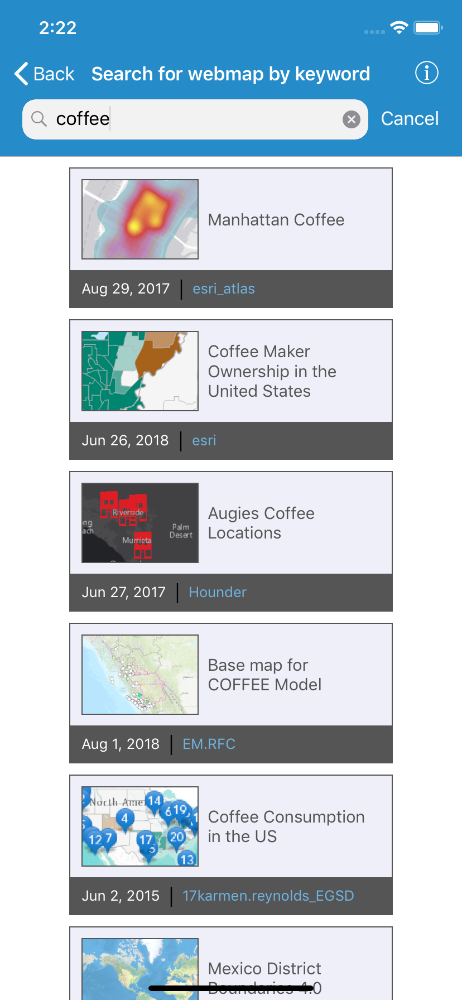

# Search for webmap by keyword

Shows how to search for webmaps within a portal using a keyword.

## How to use the sample

Input a keyword into the search field. Results load automatically as you type. Tap a result to show the webmap in a map view. 

## How it works

To search for webmaps in a `AGSPortal` matching a keyword:

1. Create a `AGSPortal` object and load it.
2. Create a `AGSPortalQueryParameters` object using `init(forItemsOf:withSearch:)`. Pass `.webMap` as the type and use the search field text to build a search query. Note that webmaps authored prior to July 2nd, 2014, are not supported, so you can also limit the query to only return maps published after that date.
3. Use `findItems(with:completion:)` to get the first set of matching items.
