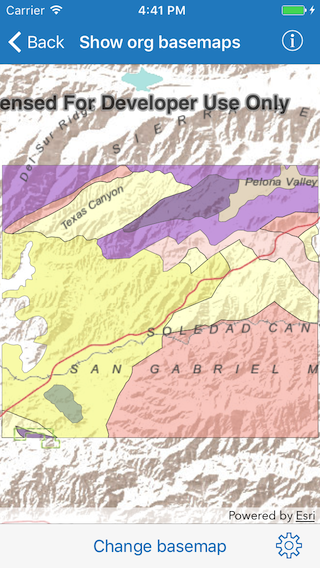
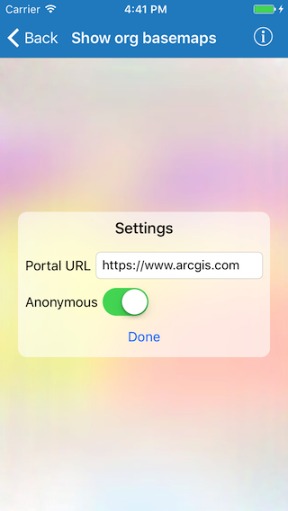
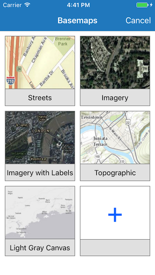

#List portal group users

This sample demonstrates how to load a portal and then use the organization's predefined basemaps query to get all basemaps.

##How to use the sample

The sample comes with a feature layer and a basemap already added to the map. Tap on the settings gear in the bottom toolbar to specify the URL to your organization’s portal. And if you want to login or not. Tap on `Done` to save the settings. Now tap on the `Change basemap` button to get the list of basemaps from the portal. By default, only 5 basemaps are listed. If more are available, you can tap on the plus button to download. You can tap to select a basemap and replace the existing the basemap in the map.

##How it works

The sample initializes an `AGSPortal` object with the portal URL provided in the settings view, with `loginRequired` set based on the `Anonymous` flag. The initializer used is `AGSPortal(url:loginRequired:)`. To get the basemaps from the portal, the `basemapGalleryGroupQuery` on the `portalInfo` is used to create `AGSPortalQueryParameters` object. The parameters object is then used to `findGroups(with:)` in the portal. The `groupID` of the resulting group is then passed as parameters to the `findItems(with:)` method to get portal items in that group. When a selection is made in the list, an `AGSBasemap` object is created from the selected portal item using the `AGSBasemap(item:)` initializer.

