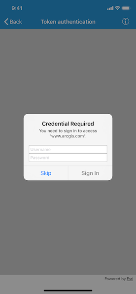

# Token authentication

Access a web map that is secured with ArcGIS token-based authentication.

## Use Case

Allows you to access a secure service with the convenience and security of ArcGIS token-based authentication. For example, rather than providing a user name and password every time you want to access a secure service, you only provide those creditials initially to obtain a token which then can be used to access secured resources.

## How to use the sample

Once you open the sample, you will be challenged for an ArcGIS Online login to view the protected map service. Enter a user name and password for an ArcGIS Online named user account (such as your ArcGIS for Developers account). If you authenticate successfully, the protected map service will display in the map.

## How it works

1. Create an `AGSPortal` object.
2. Create an `AGSPortalItem` object for the protected web map using the portal and Item ID of the protected map service.
3. Create a map to display in the map view using `AGSMap.init(item:)`.
4. Assign the map to the map view.

## Relevant API

- `AGSMap`
- `AGSMapView`
- `AGSPortal`
- `AGSPortalItem`

## About the data

The Traffic web map uses public layers as well as the world traffic (premium content) layer. The world traffic service presents historical and near real-time traffic information for different regions in the world. The data is updated every 5 minutes. This map service requires an ArcGIS Online organizational subscription.

## Tags

authentication, cloud, portal, remember, security
