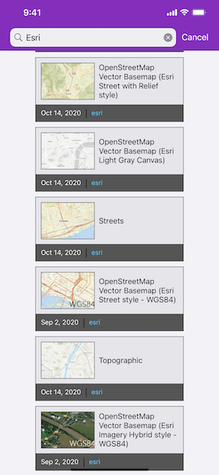

# Search for webmap by keyword

Find webmap portal items by using a search term.

## Use case

Portals can contain many portal items and, at times, you may wish to query the portal to find what you're looking for. In this example, we search for webmap portal items using a text search.

## How to use the sample

Enter search terms into the search bar. Once the search is complete, a list is populated with the resultant webmaps. Tap on a webmap to set it to the map view.

## How it works

1. Create an `AGSPortal` and load it.
2. Create an `AGSPortalQueryParameters` object using `init(forItemsOf:withSearch:)`. Pass `.webMap` as the type and use the search field text to build a search query. Note that webmaps authored prior to July 2nd, 2014, are not supported, so you can also limit the query to only return maps published after that date.
3. Use `findItems(with:completion:)` to get the first set of matching items.

## Relevant API

* AGSPortal
* AGSPortalItem
* AGSPortalQueryParameters
* AGSPortalQueryResultSet

## Tags

keyword, query, search, webmap
