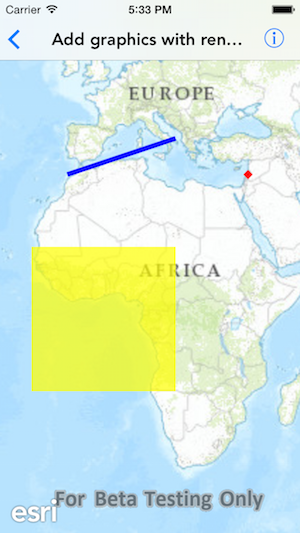

#Add graphics with renderer

This sample demonstrates how to add graphics and set renderer on graphic overlays

##How it works

The sample creates an `AGSGraphicsOverlay` for a point, line and polygon graphic. And defines a renderer of type `AGSRenderer` with `AGSSimpleMarkerSymbol`, `AGSSimpleLineSymbol` and `AGSSimpleFillSymbol` symbols respectively.

