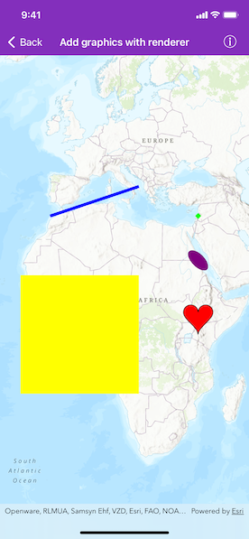

# Add graphics with renderer

A renderer allows you to change the style of all graphics in a graphics overlay by referencing a single symbol style. A renderer will only effect graphics that do not specify their own symbol style.

## Use case

A renderer allows you to change the style of all graphics in an overlay by only changing one copy of the symbol. For example, a user may wish to display a number of graphics on a map of parkland which represent trees, all sharing a common symbol.

## How to use the sample

Pan and zoom on the map to view graphics for points, lines, polygons (including polygons with curve segments) which are stylized using renderers.

## How it works

1. Create an `AGSGraphicsOverlay` and add it to the `AGSMapView`.
2. Create an `AGSGraphic`, specifying only an `AGSGeometry`.
3. Create a single `AGSSymbol` such as an `AGSSimpleMarkerSymbol`.
4. Create a renderer with `AGSSimpleRenderer(symbol:)`, passing in an `AGSSymbol`.
5. Set the renderer for the `AGSGraphicsOverlay`.

## Relevant API

* AGSCubicBezierSegment
* AGSEllipticArcSegment
* AGSGeometry
* AGSGraphic
* AGSGraphicsOverlay
* AGSMutablePart
* AGSPolygonBuilder
* AGSPolylineBuilder
* AGSSimpleFillSymbol
* AGSSimpleLineSymbol
* AGSSimpleMarkerSymbol
* AGSSimpleRenderer

## Additional information

To set unique symbols across a number of graphics (e.g. showing graphics of individual landmarks), see "Add graphics with symbols" sample.

## Tags

arc, bezier, curve, display, graphics, marker, overlay, renderer, segment, symbol, true curve
