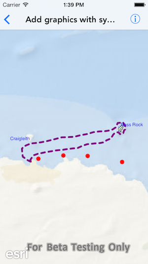

# Add graphics with symbols

This sample demonstrates how to add graphics with symbols to a graphics overlay

## How it works

The sample creates an `AGSGraphicsOverlay` for a point, line and polygon graphic. And adds a point, line, polygon and text graphic with individual symbols of type `AGSSimpleMarkerSymbol`, `AGSSimpleLineSymbol`, `AGSSimpleFillSymbol` and `AGSTextSymbol` respectively.

