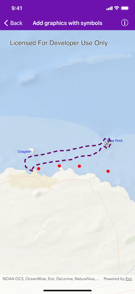

# Add graphics with symbols

Use a symbol style to display a graphic on a graphics overlay.

## Use case

Allows you to customize a graphic by assigning a unique symbol. For example, you may wish to display individual graphics for different landmarks across a region, and to style each one with a unique symbol.

## How to use the sample

Pan and zoom around the map. Observe the graphics on the map.

## How it works

1. Create an `AGSGraphicsOverlay` and add it to the `AGSMapView`.
2. Create an `AGSSymbol` such as `AGSSimpleMarkerSymbol`, `AGSSimpleLineSymbol` or `AGSSimpleFillSymbol`.
3. Create an `AGSGraphic`, specifying an `AGSGeometry` and an `AGSSymbol`.
4. Add the `AGSGraphic` to the `AGSGraphicsOverlay`.

## Relevant API

* AGSGeometry
* AGSGraphic
* AGSGraphicsOverlay
* AGSSimpleFillSymbol
* AGSSimpleLineSymbol
* AGSSimpleMarkerSymbol

## Additional information

To set a symbol style across a number of graphics (e.g. showing trees as graphics sharing a symbol in a park), see the "Add graphics with renderer" sample.

## Tags

display, fill, graphics, line, marker, overlay, point, symbol
