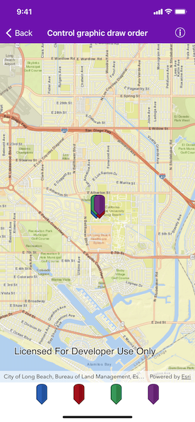
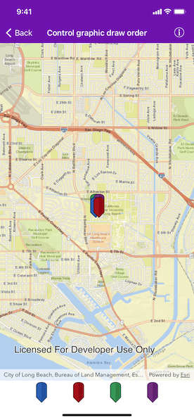

# Control graphic draw order

Change the drawing order for a graphic.

## Use case

Allows you to customize a graphic by assigning a unique symbol. For example, you may wish to bring a certain graphic to front.

## How to use the sample

The sample has four overlapping graphics. Tap on the respective graphic button in the bottom toolbar to bring that graphic to the front on the map.

## How it works

1. Create an `AGSGraphicsOverlay` and add it to the `MapView`.
2. Create and add multiple `AGSGraphic` to the `AGSGraphicsOverlay`.
3. When the graphic button is tapped, it is given a zIndex bigger than all the other graphic’s `AGSGraphic.zIndex`. Hence it is redrawn atop all other graphics.

## Relevant API

* AGSGraphic
* AGSGraphic.zIndex
* AGSGraphicsOverlay
* AGSSimpleMarkerSymbol

## Tags

display, graphics, overlap, overlay
