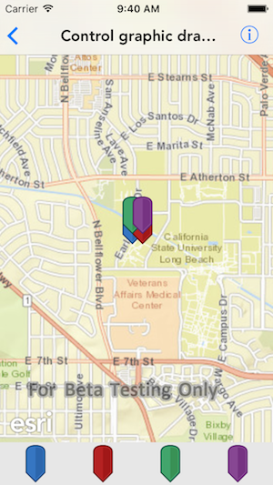
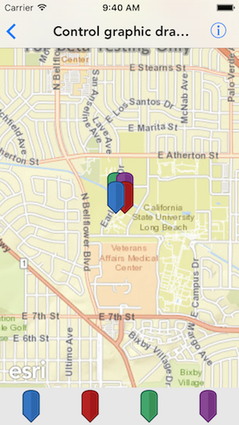

#Control graphic draw order

This sample demonstrates how to change the drawing order for a graphic

##How to use the sample

The sample has four overlapping graphics. You can tap on the respective graphic button in the bottom toolbar to bring that graphic to the front on the map.

##How it works

An `AGSGraphic` object has a `zIndex` property, that defines its order while drawing. The graphic whose zIndex is the maximum is drawn the last or on the top. When the graphic button is tapped, that graphic is assigned a zIndex bigger than all the other graphic’s zIndex. This results in graphic being redrawn and on top of all other graphics.

