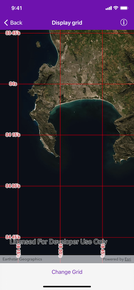

# Display grid

Display coordinate system grids including Latitude/Longitude, MGRS, UTM and USNG on a map view. Also, toggle label visibility and change the color of grid lines and grid labels.

## Use case

Grids are often used on printed maps, but can also be helpful on digital maps, to identify locations on a map.

## How to use the sample

Tap on the `Change Grid` button in the toolbar to open the settings view. You can select type of grid from `Grid Type` (LatLong, MGRS, UTM and USNG) and modify it's properties like grid visibility, grid color, label visibility, label color, label position, label format and label unit.

## How it works

1. Create an instance of one of the `AGSGrid` types.
2. Grid lines and labels can be styled per grid level with `AGSGrid.setLineSymbol(_:forLevel:)` and `AGSGrid.setTextSymbol(_:forLevel:)` methods on the grid.
3. The label position, format, unit and visibility can be specified with `labelPosition`, `labelFormat`, `labelUnit` and `isVisible` on the `AGSGrid`.
4. For the `AGSLatitudeLongitudeGrid` type, you can specify a label format of `AGSLatitudeLongitudeGridLabelFormat.decimalDegrees` or `AGSLatitudeLongitudeGridLabelFormat.degreesMinutesSeconds`.
5. To set the grid, specify the `AGSMapView.grid` for the map view.

## Relevant API

* AGSGrid
* AGSLatitudeLongitudeGrid
* AGSMapView
* AGSMGRSGrid
* AGSSimpleLineSymbol
* AGSTextSymbol
* AGSUSNGGrid
* AGSUTMGrid

## Tags

coordinates, degrees, graticule, grid, latitude, longitude, MGRS, minutes, seconds, USNG, UTM
