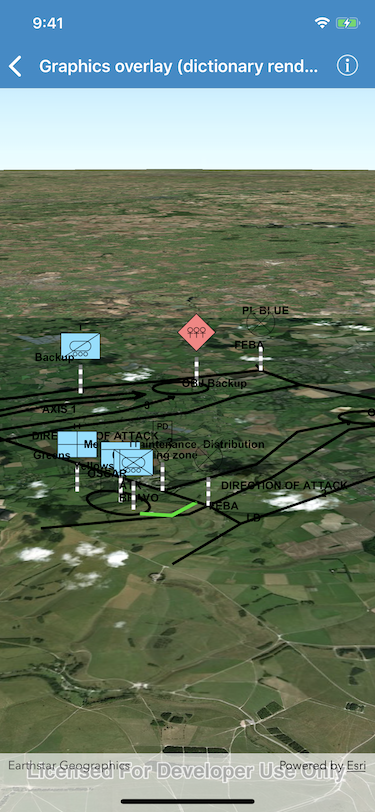

# Graphics overlay (dictionary renderer) 3D

Display MIL-STD-2525D military symbology in 3D.

The dictionary renderer creates these graphics using the mil2525d style file plus an XML file with key-value attributes for each graphic.

## How it works

To apply an `AGSDictionaryRenderer` and display mil2525d graphics in 3D:

1. Create an `AGSDictionarySymbolStyle` object with the "mil2525d" specification type.
2. Create an `AGSDictionaryRenderer` object with the dictionary symbol style.
3. Create an instance of `AGSGraphicsOverlay`.
4. Set the dictionary renderer as the renderer of the graphics overlay.
5. Parse an XML file conforming to the specification. It should have key-value pairs to use as attributes for each graphic:
  - Use the name of the XML node as the attribute key and the content of the node as the attribute value.
  - Get the WKID and coordinates from the XML to create the graphic's geometry.
6. Create an `AGSGraphic` object for each messages with the geometry and attributes and add it to the graphics overlay.

## Relevant API

- `AGSGraphicsOverlay`
- `AGSDictionaryRenderer`
- `AGSDictionarySymbolStyle`

## Tags

Graphics, Symbology, 3D
