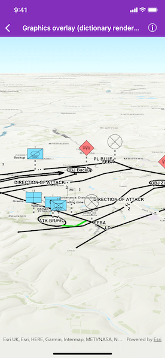

# Graphics overlay (dictionary renderer) 3D

Create graphics using a local mil2525d style file and an XML file with key/value pairs for each graphic, and display the military symbols in 3D.

## Use case

Use a dictionary renderer on a graphics overlay to display more transient data, such as military messages coming through a local tactical network.

## How to use the sample

Run the sample and view the military symbols on the map.

## How it works

1. Create a new `AGSDictionarySymbolStyle` object with the "mil2525d" specification type.
2. Create a new `AGSDictionaryRenderer` object with the dictionary symbol style.
3. Create an instance of `AGSGraphicsOverlay`.
4. Set the dictionary renderer to the graphics overlay.
5. Parse through the local XML file creating a map of key/value pairs for each block of attributes.
6. Create an instance of `AGSGraphic` for each attribute.
7. Use the `_wkid` key to get the geometry's spatial reference.
8. Use the `_control_points` key to get the geometry's shape.
9. Add the graphic to the graphics overlay.

## Relevant API

* AGSDictionaryRenderer
* AGSDictionarySymbolStyle
* AGSGraphicsOverlay

## Offline data

The sample viewer will download offline data [mil2525d style file](https://www.arcgis.com/home/item.html?id=e34835bf5ec5430da7cf16bb8c0b075c) automatically before loading the sample.

## Tags

defense, military, situational awareness, tactical, visualization
