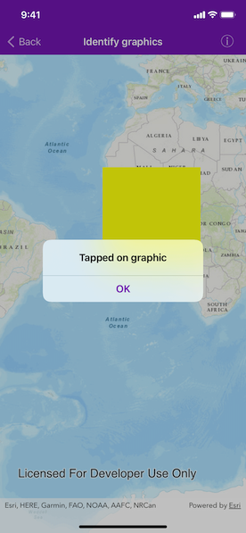

# Identify graphics

Display an alert message when a graphic is clicked.

## Use case

A user may wish to select a graphic on a map to view relevant information about it.

## How to use the sample

Tap on a graphic to identify it. You will see an alert message displayed.

## How it works

1. Create an `AGSGraphicsOverlay` and add it to the `AGSMapView`.
2. Add an `AGSGraphic` along with an `AGSSimpleFillSymbol` to the graphics overlay.
3. Use `AGSGeoViewTouchDelegate.geoView(_:didTapAtScreenPoint:mapPoint:)` to get the `mapPoint` where a user tapped on the map.
4. Identify the graphic tapped on the map view with `AGSMapView.identify(_:screenPoint:tolerance:returnPopupsOnly:maximumResults:completion:)`.

## Relevant API

* AGSGraphic
* AGSGraphicsOverlay
* AGSMapView

## Tags

graphics, identify
