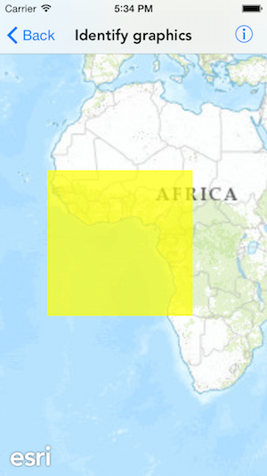
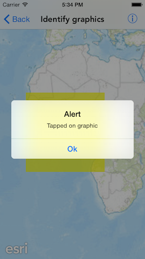

#Identify graphics

This sample demonstrates how to identify graphics in a graphics overlay

##How to use the sample

When you tap on a graphic on the map, you should see an alert

##How it works

It requires the `mapView:didTapAtPoint:mapPoint:` method on `AGSMapViewTouchDelegate` to know when a user tapped on the map. The method provides a property `mapPoint` which specifies the corresponding touch location in the map. The app then uses the `identifyGraphicsOverlay:screenCoordinate:tolerance:maximumGraphics:completion:` method on `AGSMapView` to identify graphics at that particular touch location.

Related: `identifyGraphicsOverlaysAtScreenCoordinate:tolerance:maximumGraphics:completion:`

