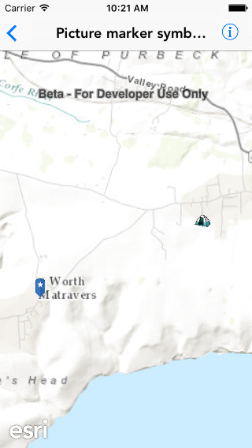

#Picture marker symbols

This sample demonstrates how to create picture marker symbols using a remote image and an image in assets.

##How it works

For creating a picture marker symbol using remote image, the sample uses the `initWithURL:` initializer on `AGSPictureMarkerSymbol`, passing the URL for the image as the argument. For creating a picture marker symbol using an image in assets, it uses the `initWithImage:` initializer. For which it creates a `UIImage` using the name of the image and passes that as an argument to the initializer.

