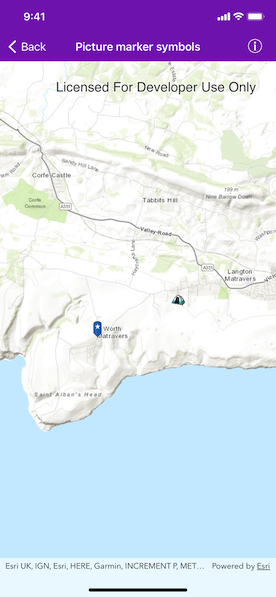

# Picture marker symbols

Use pictures for markers.

## Use case

When marking geo-elements on a map, using custom, unique symbols can be helpful for highlighting and differentiating between locations. For example, a tourism office may use pictures of landmarks as symbols on an online map or app, to help prospective visitors to orient themselves more easily around a city.

## How to use the sample

When launched, this sample displays a map with two picture marker symbols. Pan and zoom to explore the map.

## How it works

1. Create an `AGSPictureMarkerSymbol` using the URI to an online or local image.
2. Create an `AGSGraphic` and set its symbol to the picture marker symbol.

## Relevant API

* AGSPictureMarkerSymbol

## About the data

The picture marker symbols in this sample are all constructed from different types of resources:

- [Campsite symbol constructed from a URL](http://sampleserver6.arcgisonline.com/arcgis/rest/services/Recreation/FeatureServer/0/images/e82f744ebb069bb35b234b3fea46deae).
- Blue pin with a star stored in the resource folder that comes with the application.

## Tags

graphics, marker, picture, symbol, visualization
