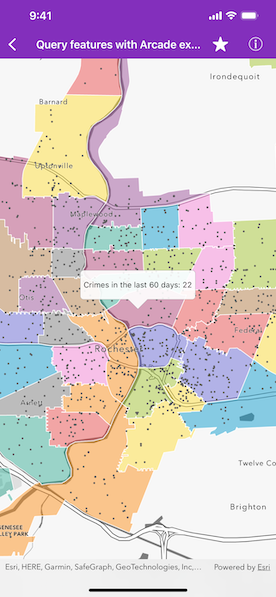

# Query features with Arcade expression

Query features on a map using an Arcade expression.



## Use case

Arcade is a portable, lightweight, and secure expression language used to create custom content in ArcGIS applications. Like other expression languages, it can perform mathematical calculations, manipulate text, and evaluate logical statements. It also supports multi-statement expressions, variables, and flow control statements. What makes Arcade particularly unique when compared to other expression and scripting languages is its inclusion of feature and geometry data types. This sample uses an Arcade expression to query the number of crimes in a neighborhood in the last 60 days.

## How to use the sample

Tap on any neighborhood to see the number of crimes in the last 60 days in a callout.

## How it works

1. Create an `AGSPortalItem` using the portal and ID.
2. Create an `AGSMap` using the portal item.
3. Set the visibility of all the layers to false, except for the layer named "RPD Beats  - City_Beats_Border_1128-4500".
4. Set the `AGSGeoViewTouchDelegate` to the map.
5. Identify the layers tapped on the map view with `AGSGeoView.identifyLayers(atScreenPoint:tolerance:returnPopupsOnly:completion:)`.
6. Create the following `AGSArcadeExpression`:

    ```swift		
        expressionValue = "var crimes = FeatureSetByName($map, 'Crime in the last 60 days');\n"
     				   "return Count(Intersects($feature, crimes));"
    ```
            
7. Create an `AGSArcadeEvaluator` using the Arcade expression and `ArcadeProfile.FORM_CALCULATION`.
8. Create a dictionary of profile variables with the following pairs:

    `{"$feature", identifiedFeature}`
	 
    `{"$map", map}`
	 
9. Use `AGSArcadeEvaluator.evaluate(withProfileVariables:completion:)` with the profile variables to evaluate the Arcade expression.
10. Convert the result to a `String` to display the crime count in a callout.

## Relevant API

* AGSArcadeEvaluationResult
* AGSArcadeEvaluator
* AGSArcadeExpression
* AGSArcadeProfile
* AGSPortal
* AGSPortalItem

## About the data

This sample uses the [Crimes in Police Beats Sample](https://www.arcgis.com/home/item.html?id=14562fced3474190b52d315bc19127f6) ArcGIS Online Web Map which contains 3 layers for police stations, city beats borders, and crimes in the last 60 days as recorded by the Rochester, NY police department.

## Additional information

Visit [Getting Started](https://developers.arcgis.com/arcade/) on the *ArcGIS Developer* website to learn more about Arcade expressions.

## Tags

Arcade evaluator, Arcade expression, identify layers, portal, portal item, query
