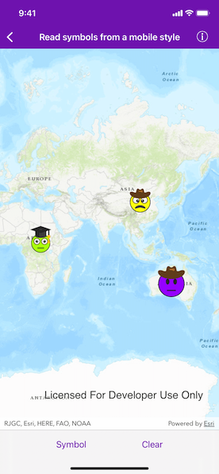
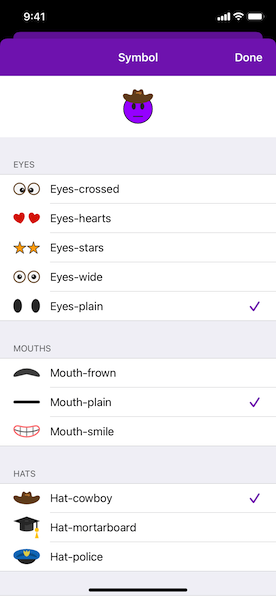

# Read symbols from a mobile style

Combine multiple symbols from a mobile style file into a single symbol.

## Use case

You may choose to display individual elements of a dataset like a water infrastructure network (such as valves, nodes, or endpoints) with the same basic shape, but wish to modify characteristics of elements according to some technical specifications. Multilayer symbols lets you add or remove components or modify the colors to create advanced symbol styles.

## How to use the sample

Tap "Symbol" and select symbols from each table view section to create a face emoji. A preview of the symbol is updated as selections are made. The size of the symbol can be set using the slider. Tap the map to create a point graphic using the customized emoji symbol, and tap "Clear" to clear all graphics from the display.

## How it works

1. Read a mobile style file using `AGSSymbolStyle.load(completion:)`.
2. Get a list of all symbols in the style by calling `AGSSymbolStyle.searchSymbols(with:completion:)` with the default search parameters.
3. Add symbols to the table view sections according to their category. Display a preview of each symbol with `AGSSymbol.createSwatch(withWidth:height:screen:backgroundColor:completion:)`.
4. When symbol selections change, create a new multilayer symbol by passing the keys for the selected symbols into `AGSSymbolStyle.symbol(forKeys:completion:)`. Color lock all symbol layers except the base layer and update the current symbol preview image.
5. Create graphics symbolized with the current symbol when the user taps the map view.

## Relevant API

* AGSMultilayerPointSymbol
* AGSMultilayerSymbol
* AGSSymbolLayer
* AGSSymbolStyle
* AGSSymbolStyleSearchParameters

## Offline Data

A [mobile style file](https://www.arcgis.com/home/item.html?id=1bd036f221f54a99abc9e46ff3511cbf) (created using ArcGIS Pro) provides the symbols used by the sample.

## About the data

The mobile style file used in this sample was created using ArcGIS Pro, and is hosted on [ArcGIS Online](https://www.arcgis.com/home/item.html?id=1bd036f221f54a99abc9e46ff3511cbf). It contains symbol layers that can be combined to create emojis.

## Additional information

While each of these symbols can be created from scratch, a more convenient workflow is to author them using ArcGIS Pro and store them in a mobile style file (.stylx). ArcGIS Runtime can read symbols from a mobile style, and you can modify and combine them as needed in your app.

## Tags

advanced symbology, multilayer, mobile style, stylx
