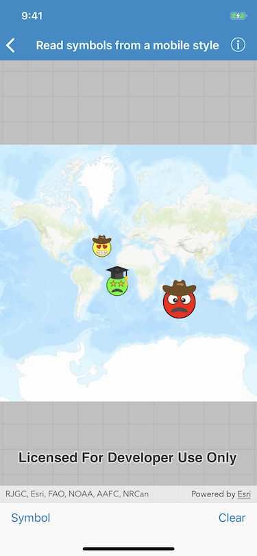
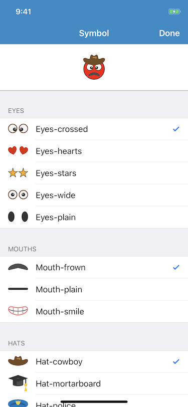

# Read symbols from a mobile style

Open a mobile style (.stylx) and read its contents. Combine several symbols from the style into a single multilayer point symbol, then use it to display graphics in the map view.

 

## Use case

Multilayer symbols provide the ability to create much more complex and interesting symbology for geoelements. While these symbols can be created from scratch, a more convenient workflow is to author them using ArcGIS Pro and store them in a mobile style file (.stylx). ArcGIS Runtime can read symbols from a mobile style, and you can modify and combine them as needed in your app.

## How to use the sample

- Tap Symbol and select symbols from each table view section to create a face emoji. A preview of the symbol is updated as you make selections.
- You can optionally modify the color and set the symbol size using the slider.
- Tap the map to create a point graphic that uses the current face symbol.
- Tap the Clear button to clear all graphics from the display.

## How it works

1. Read a mobile style file using `AGSSymbolStyle.load(completion:)`. 
2. Get a list of all symbols in the style by calling `AGSSymbolStyle.searchSymbols(with:completion:)` with the default search parameters.
3. Add symbols to the table view sections according to their category. Display a preview of each symbol with `AGSSymbol.createSwatch(withWidth:height:screen:backgroundColor:completion:)`.
4. When symbol selections change, create a new multilayer symbol by passing the keys for the selected symbols into `AGSSymbolStyle.symbol(forKeys:completion:)`. Color lock all symbol layers except the base layer and update the current symbol preview image.
5. Create graphics symbolized with the current symbol when the user taps the map view.

## Relevant API

* `AGSMultilayerPointSymbol`
* `AGSSymbol.createSwatch(withWidth:height:screen:backgroundColor:completion:)`
* `AGSSymbolLayer`
* `AGSSymbolStyle`
* `AGSSymbolStyle.symbol(forKeys:completion:)`
* `AGSSymbolStyleSearchParameters`

## Offline Data

A [mobile style file](https://www.arcgis.com/home/item.html?id=1bd036f221f54a99abc9e46ff3511cbf) (created using ArcGIS Pro) provides the symbols used by the sample.

## Tags

advanced symbology, multilayer, mobile style, stylx
