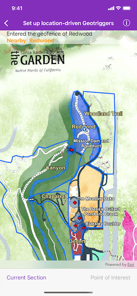
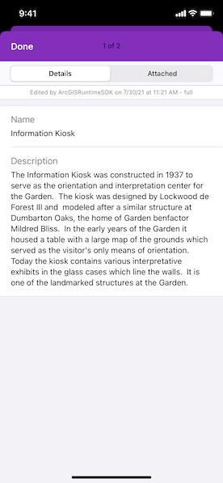

# Set up location-driven geotriggers

Create a notification every time a given location data source has entered and/or exited a set of features or graphics.

## Use case

Geotriggers can be used to notify users when they have entered or exited a geofence by monitoring a given set of features or graphics. They could be used to display contextual information to museum visitors about nearby exhibits, notify hikers when they have wandered off their desired trail, notify dispatchers when service workers arrive at a scene, or more.

## How to use the sample

Observe a virtual walking tour of the Santa Barbara Botanic Garden. Information about the user's current Garden Section, as well as information about nearby points of interest within 10 meters will display or be removed from the UI when the user enters or exits the buffer of each feature.

## How it works

1. Create an `AGSLocationGeotriggerFeed` with an `AGSSimulatedLocationDataSource`.
2. Create an `AGSFeatureFenceParameters` from an `AGSServiceFeatureTable`, a buffer distance at which to monitor each feature, an Arcade Expression, and a name for the specific geotrigger.
3. Create an `AGSFenceGeotrigger` with the geotrigger feed, an `AGSFenceRuleType`, and the fence parameters.
4. Create an `AGSGeotriggerMonitor` with the fence geotrigger and call `start(completion:)` method to begin observing for notifications that meet the `AGSFenceRuleType`.
5. When a notification is posted, capture the `AGSFenceGeotriggerNotificationInfo`.
6. For more information about the feature that triggered the notification, access the `fenceGeoElement` property of the `AGSFenceGeotriggerNotificationInfo`.
7. Depending on the `AGSFenceNotificationType`, update information on the UI from the geo-element's attributes.

## Relevant API

* AGSArcadeExpression
* AGSFeatureFenceParameters
* AGSFenceGeotrigger
* AGSFenceGeotriggerNotificationInfo
* AGSFenceRuleType
* AGSGeoElement
* AGSGeotriggerMonitor
* AGSGeotriggerNotificationInfoKey
* AGSLocationGeotriggerFeed
* AGSServiceFeatureTable
* AGSSimulatedLocationDataSource

## About the data

This sample uses the [Santa Barbara Botanic Garden Geotriggers Sample](https://arcgis.com/home/item.html?id=6ab0e91dc39e478cae4f408e1a36a308) ArcGIS Online Web Map which includes a geo-referenced map of the garden as well as select polygon and point features to denote garden sections and points of interest. Description text and attachment images in the feature layers were provided by the Santa Barbara Botanic Garden and more information can be found on the [Garden Sections & Displays](https://www.sbbg.org/explore-garden/garden-sections-displays) portion of their website. All assets are used with permission from the Santa Barbara Botanic Garden. For more information, visit the [Santa Barbara Botanic Garden](https://www.sbbg.org) website.

## Tags

alert, arcade, fence, geofence, geotrigger, location, navigation, notification, notify, routing, trigger
