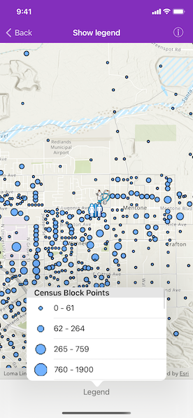

# Show legend

Show a legend for all the operational layers in the map.

## Use case

Legends are used to describe what each symbol on a map represents. A common format is to show an image of the symbol alongside of a text description of what that symbol represents. This sample demonstrates how to show a legend for all the operational layers in the map.

## How to use the sample

1. Open the sample
2. Scroll through the legends to see the various elements that represent features on the map.

## How it works

1. Layers implement the `AGSLayerContent` interface, which contain a list of `AGSLegendInfo`. `AGSLegendInfo` contains an `AGSSymbol` and a name string. `AGSLayerContent.fetchLegendInfos(completion:)` must be called on each `AGSLayerContent` instance to fetch the info from the data.
2. For each symbol in the `AGSLegendInfo` list, `AGSSymbol.createSwatch(completion:)` must be called so that an image of the `AGSSymbol` is returned.
3. The names and images are then displayed next to each other in a list.

## Relevant API

* AGSLayerContent
* AGSLegendInfo

## Tags

legend, legend info, symbol swatch, toolkit
