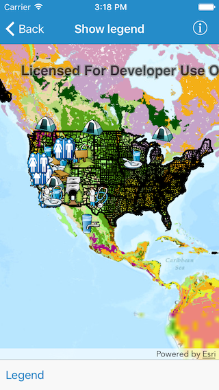
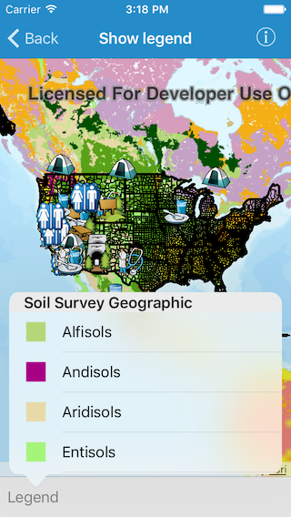
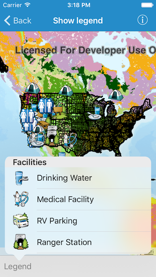

#Show legend

This sample demonstrates how to show a legend for all the operational layers in the map

##How to use the sample

The map in the app comes loaded with multiple operational layers. When you tap on the `Legend` button in the bottom toolbar you are shown a list of legends for each of those layers and their sublayers.

##How it works

The sample runs through each layer in the operational layers list and calls `fetchLegendInfos(completion:)` method on it or its sublayers. On completion, the method returns an array of `AGSLegendInfo` objects. Each of these objects contain the symbol and the name describing the legend. 

