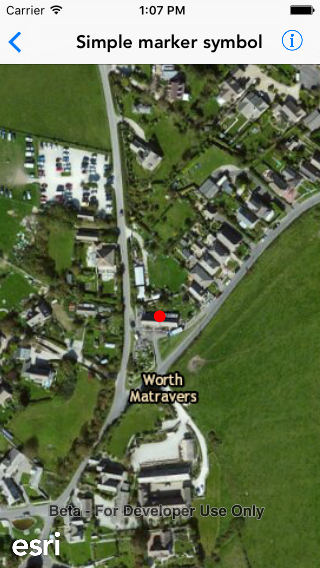

#Simple marker symbol

This sample demonstrates how to create a graphic with simple marker symbol

##How it works

The sample creates a `AGSSimpleMarkerSymbol` object using the `initWithStyle:color:size:` initializer. It uses a predefined point and the symbol created to initialize an `AGSGraphic` object. The graphic is then added to a graphics overlay on the map view.

