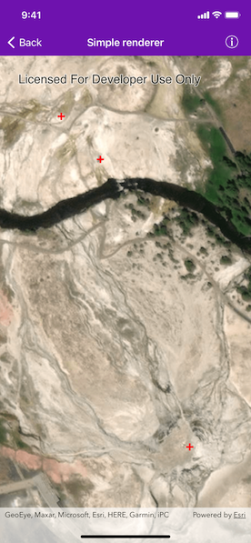

# Simple renderer

Display common symbols for all graphics in a graphics overlay with a renderer.

## Use case

Graphics are often used to display data that changes location regularly because they are held in memory instead of being persisted to the map. When a number of graphics are required to share the same style, a simple renderer can be applied to the graphics overlay containing the graphics. For example, the location of mobile taxis from a same company could be plotted on a map with each taxi marked by a relevant symbol.

## How to use the sample

The sample loads with a predefined simple renderer, which displays a red cross simple marker symbol for the graphics in the graphics overlay.

## How it works

1. Create an instance of `AGSGraphicsOverlay`.
2. Create 3 `AGSPoint` objects with x, y and spatial reference parameters.
3. Create an `AGSSimpleMarkerSymbol` passing in an `AGSSimpleMarkerSymbolStyle`, color and size as parameters.
4. Create a simple renderer with `AGSSimpleRenderer(symbol:)`.
5. Set the simple renderer to the graphics overlay's `renderer` property.
6. Create a number of `AGSGraphic` objects with the points initiated in step 2.
7. Add the graphics to the graphics overlay.

## Relevant API

* AGSGraphic
* AGSGraphicsOverlay
* AGSPoint
* AGSSimpleMarkerSymbol
* AGSSimpleRenderer

## Additional information

Renderers are used to display graphics that don't already have a symbol set. A renderer will not override a graphic's symbol if one has been set.

## Tags

graphics, marker, renderer, symbol, symbolize, symbology
