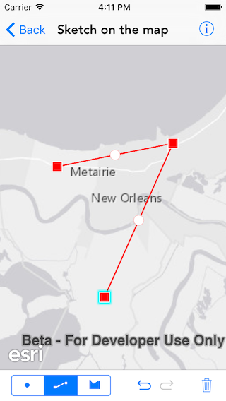
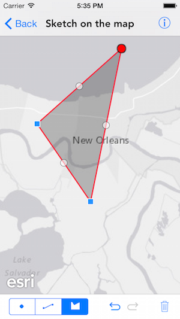

# Sketch on the map

This sample demonstrates how you can use the sketch editor to draw point or line or polygon geometry. Sketch editor now also supports freehand polyline and polygon drawing.

## How to use the sample

The sample has a toolbar of sketch tools at the bottom. You can choose the type of geometry using the switch. Sketch by tapping or tapping and dragging (for freehand mode) on the map. There are tools to undo or redo an action or clear everything.

## How it works

The sample uses `start(with:creationMode:)` initializer on `AGSSketchEditor`. The initializer takes in the creation mode which could be any of the following:

- Point
- Polyline
- FreehandPolyline
- Polygon
- FreehandPolygon

The sketch editor has a undo manager of type `NSUndoManager` that provides the undo and redo methods. To clear everything there is a `clear` method on the sketch graphics overlay.

