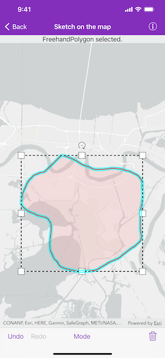

# Sketch on map

Use the Sketch Editor to edit or sketch a new point, line, or polygon geometry on a map.

## Use case

A field worker could annotate features of interest on a map (via the GUI) such as location of dwellings (marked as points), geological features (polylines), or areas of glaciation (polygons).

## How to use the sample

Choose which geometry type to sketch from one of the available buttons. Choose from points, multipoints, polylines, polygons, freehand polylines, and freehand polygons.

Use the control panel to cancel the sketch, undo or redo changes made to the sketch and to save the sketch to the graphics overlay. There is also the option to select a saved graphic and edit its geometry using the Sketch Editor. The graphics overlay can be cleared using the clear all button.

## How it works

1. Create an `AGSSketchEditor` and set it to the map view's `sketchEditor` property.
2. Use `AGSSketchEditor.start(with:creationMode:)` to start sketching. If editing an existing graphic's geometry, use `AGSSketchEditor.start(with:)`.
3. Check to see if undo and redo are possible during a sketch session with `canUndo` and `canRedo` using `AGSSketchEditor.undoManager`. If it's possible, use `AGSSketchEditor.undoManager.undo()` and `AGSSketchEditor.undoManager.redo()`.
4. To exit the sketch editor, use `AGSSketchEditor.stop()`.

## Relevant API

* AGSGeometry
* AGSGraphic
* AGSGraphicsOverlay
* AGSMapView
* AGSSketchCreationMode
* AGSSketchEditor

## Tags

draw, edit, AGSGeometry, AGSGraphic, AGSGraphicsOverlay, AGSSketchCreationMode, AGSSketchEditor
