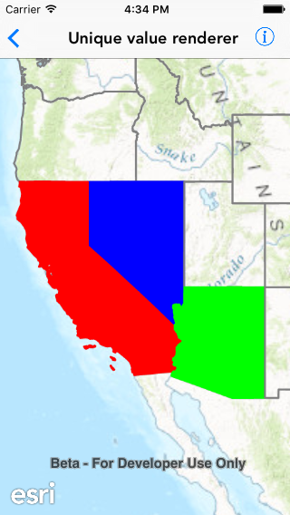

# Unique value renderer

This sample demonstrate how to use a unique value renderer to style different features in a feature layer with different symbols. Features do not have a symbol property for you to set, renderers should be used to define the symbol for features in feature layers. The unique value renderer allows for separate symbols to be used for features that have specific attribute values in a defined field.

## How it works

The sample instantiates an `AGSFeatureLayer` object and creates a custom unique value renderer for it using `AGSUniqueValueRenderer` class. It defines the field names from the feature layer to be used for unique values using the `fieldNames` property on unique value renderer. It then defines an `AGSSimpleFillSymbol` symbol as the defaultSymbol. Creates a unique value for California, Arizona and Nevada with different symbols. Then adds these unique values to the renderer and assigns the render to the feature layer.

