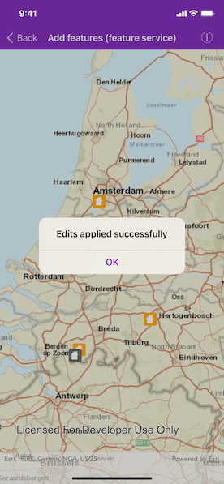

# Add features (feature service)

Add features to a feature layer.

## Use case

An end-user performing a survey may want to add features to the map during the course of their work.

## How to use the sample

Tap on a location on the map to add a feature at that location.

## How it works

An `AGSFeature` instance is added to an `AGSServiceFeatureTable` which then pushes that new feature to the server.

1. Create an `AGSServiceFeatureTable` from a URL.
2. Create an `AGSFeatureLayer` derived from the `AGSServiceFeatureTable` instance.
3. Create an `AGSFeature` with attributes and a location using the `AGSServiceFeatureTable`.
4. Add the `AGSFeature` to the `AGSServiceFeatureTable`.
5. Use `AGSServiceFeatureTable.applyEdits(completion:)` to to apply edits to the `AGSServiceFeatureTable` which will upload the new feature to the online service.

## Relevant API

* AGSFeature
* AGSFeatureEditResult
* AGSFeatureLayer
* AGSServiceFeatureTable

## Tags

edit, feature, online service
