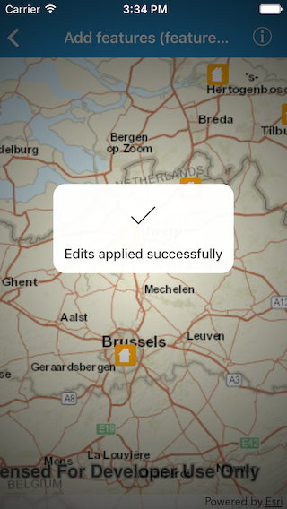

#Add features (feature service)

This sample demonstrates how to add features to the feature layer using a feature service.

##How to use the sample

Tap on a location in the map view to add a feature at that location

##How it works

The sample uses the `geoView(_:didTapAtScreenPoint:mapPoint:)` method on `AGSGeoViewTouchDelegate` to get the tapped point. Creates a new feature using `createFeature(attributes:geometry:)` method on `AGSServiceFeatureTable`. Adds the new feature to the feature table using `add(_:completion:)` method and applies the edit to the service using the `applyEdits(completion:)` method.

