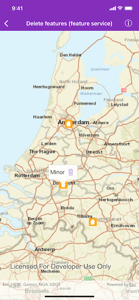
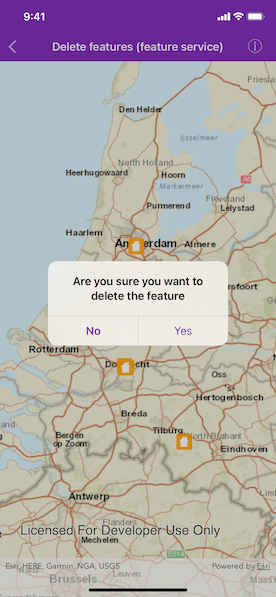

# Delete features (feature service)

Delete features from an online feature service.

## Use case

Sometimes users may want to delete features from an online feature service.

## How to use the sample

Tap on a feature to display a callout. Tap on the trash can icon in the callout to delete the feature.

## How it works

1. Create an `AGSServiceFeatureTable` object from a URL.
2. Create an `AGSFeatureLayer` object from the `AGSServiceFeatureTable`.
3. Identify the selected feature by using `AGSGeoView.identifyLayer(_:screenPoint:tolerance:returnPopupsOnly:maximumResults:completion:)`
4. Remove the selected features from the `AGSServiceFeatureTable` using `AGSFeatureTable.delete(_:completion:)`.
5. Update the table on the server using `AGSServiceFeatureTable.applyEdits(completion:)`.

## Relevant API

* AGSFeature
* AGSFeatureLayer
* AGSServiceFeatureTable

## Tags

deletion, feature, online, Service, table
