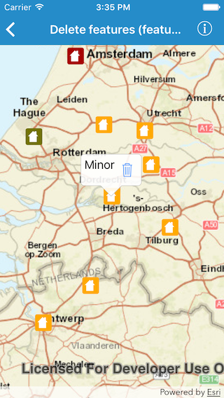
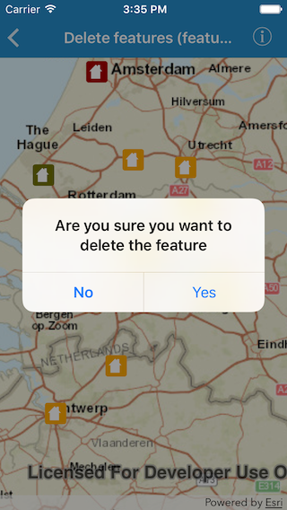

#Delete features (feature service)

This sample demonstrates how to delete features from a feature layer that uses a feature service.

##How to use the sample

Tap on a feature on the map. The callout should show. Tap on the trash button in the callout to delete the feature. An alert should show asking for confirmation

##How it works

The sample uses the `geoView(_:didTapAtScreenPoint:mapPoint:)` method on `AGSGeoViewTouchDelegate` to get the tapped point. Identifies the feature around that point using `identifyLayer(_:screenPoint:tolerance:returnPopupsOnly:maximumResults:completion:)` method on `AGSMapView`. It then shows a callout for that feature using the `show(for:tapLocation:animated:)` method on `mapView.callout`. When tapped on the trash icon, it deletes feature using `delete(_:completion:)` method and applies the edit to the service using the `applyEdits(completion:)` method.

