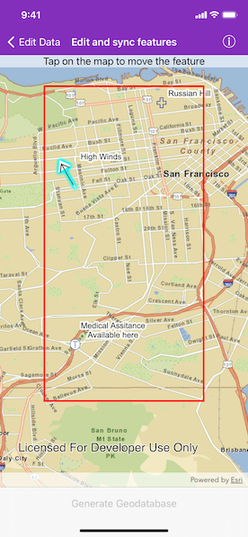

# Edit and sync features

Synchronize offline edits with a feature service.

## Use case

A survey worker who works in an area without an internet connection could take a geodatabase of survey features offline at their office, make edits and add new features to the offline geodatabase in the field, and sync the updates with the online feature service after returning to the office.

## How to use the sample

Pan and zoom to position the red rectangle around the area to be taken offline. Tap "Generate geodatabase" to take the area offline. To edit features, tap to select a feature, and tap again anywhere else on the map to move the selected feature to the tapped location. To sync the edits with the feature service, tap the "Sync geodatabase" button.

## How it works

1. Create a geodatabase sync task from a URL to a feature service.
2. Generate the geodatabase sync task to create geodatabase parameters by passing in an envelope extent as the parameter.
3. Create a generate job, passing in the parameters and a path to where the geodatabase should be downloaded locally.
4. Start the job and get a geodatabase as a result.
5. Set the sync direction.
6. To enable editing, load the geodatabase and get its feature tables. Create feature layers from the feature tables and add them to the map's operational layers collection.
7. Create a sync job passing in the parameters and geodatabase as arguments.
8. Start the sync job to synchronize the edits.

## Relevant API

* AGSFeatureLayer
* AGSFeatureTable
* AGSGenerateGeodatabaseJob
* AGSGenerateGeodatabaseParameters
* AGSGeodatabaseSyncTask
* AGSSyncGeodatabaseJob
* AGSSyncGeodatabaseParameters
* AGSSyncLayerOption

## About the data

The basemap uses an offline tile package of San Francisco. The online feature service has features with wildfire information.

## Tags

feature service, geodatabase, offline, synchronize
