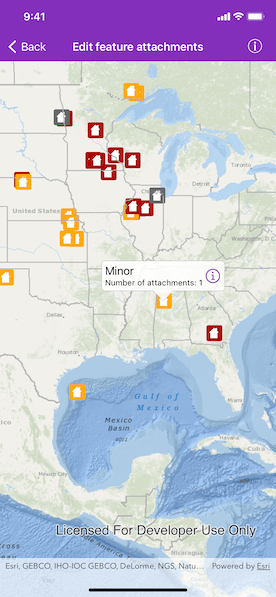
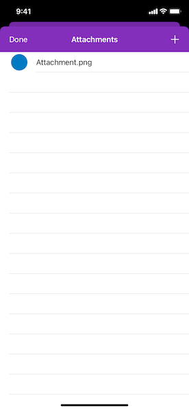

# Edit feature attachments

Add, delete, and download attachments for features from a service.

## How to use the sample

## Use case

Attachments provide a flexible way to manage additional information that is related to your features. Attachments allow you to add files to individual features, including: PDFs, text documents, or any other type of file. For example, if you have a feature representing a building, you could use attachments to add multiple photographs of the building taken from several angles, along with PDF files containing the building's deed and tax information.

## How to use the sample

Tap a feature on the map to open a callout displaying the number of attachments. Tap on the info button to view/edit the attachments. Select an entry from the list to download and view the attachment in the gallery. Tap on the action button '+' to add an attachment or swipe left on an attachment to delete.

## How it works

1. Create an `AGSServiceFeatureTable` from a URL.
2. Create an `AGSFeatureLayer` object from the service feature table.
3. Find the layer of the selected feature using  `AGSGeoView.identifyLayer(_:screenPoint:tolerance:returnPopupsOnly:maximumResults:completion:)`, which provides an `AGSIdentifyLayerResult` used to get the selected feature. 
4. To fetch the feature's attachments, use `AGSArcGISFeature.fetchAttachments(completion:)`.
5. To add an attachment to the selected `AGSArcGISFeature`, create an attachment and use `AGSArcGISFeature.addAttachment(withName:contentType:data:completion:)`.
6. To delete an attachment from the selected `AGSArcGISFeature`, use the `AGSArcGISFeature.delete(_:completion:)`.
7. After a change, apply the changes to the server using `AGSServiceFeatureTable.applyEdits(completion:)`.

## Additional information

Attachments can only be added to and accessed on a service feature table when its `hasAttachments` property is true.

## Relevant API

* AGSArcGISFeature.delete(_:completion:)
* AGSArcGISFeature.fetchAttachments(completion:)
* AGSFeatureLayer
* AGSServiceFeatureTable
* AGSServiceFeatureTable.applyEdits(completion:)

## Tags

Edit and Manage Data, image, picture, JPEG, PNG, PDF, TXT
