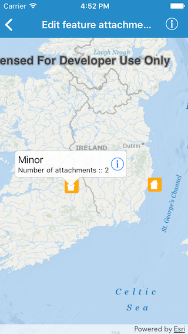
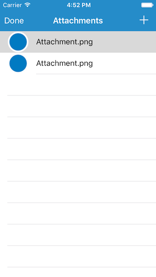

#Edit feature attachments

The sample demonstrates how you can add, delete or fetch attachments for a specific feature in a feature layer.

##How to use the sample

Tapping on a feature, shows a callout. The callout specifies the number of attachments for that particular feature. Tapping on the info button inside callout shows the list of those attachments. In the list you can, add a new attachment by tapping on the `+` button. You can delete an attachment by sliding a cell to left and tapping `Delete`. And you can select a row to get the thumbnail for that attachment if its not already visible.

##How it works

The sample uses the `fetchAttachments(completion:)` method on `AGSArcGISFeature` to fetch information about attachments that belong to the feature. In its completion block, it returns an array of `AGSAttachment` objects. The number of these objects is used to specify the count, in the callout. The table view controller for attachments uses the `fetchData(completion:)` on `AGSAttachment` to get the raw data for the attachment and generate a thumbnail. When you tap on the `+` button, a hard coded image is added as a new attachment using `addAttachment(withName:contentType:data:completion:)` method on the feature. Similarly, `delete(_:completion:)` method is used to delete an attachment. All these changes are still on the local feature table and in order to apply the edits to the service, `applyEdits(completion:)` method is used on `AGSServiceFeatureTable`.

