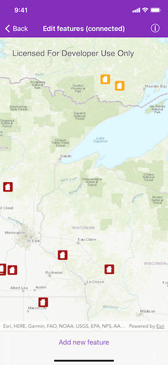
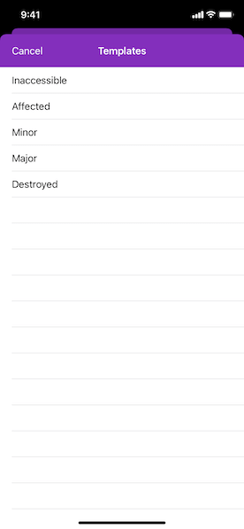
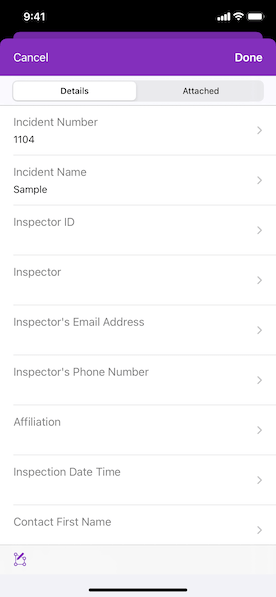

# Edit features (connected)

View, edit, or add features using a popup.  

## Use case 
An end-user performing a survey may want to view, edit, or add features on a map using a popup during the course of their work. 

## How to use the sample

Pan and zoom to explore various features. Tap on an existing feature to view or edit its data. Tap the "Add new feature" button to add a new feature to the map. 

## How it works

1. Create an `AGSServiceFeatureTable` object from a URL.
2. Create an `AGSFeatureLayer` object from the `AGSServiceFeatureTable`.
3. Select features using `AGSGeoView.identifyLayer(_:screenPoint:tolerance:returnPopupsOnly:maximumResults:completion:)` and `AGSIdentifyLayerResult`.
4. Create an `AGSPopup` to display data and allow editing.
5. Create a new feature with a specific template using `AGSArcGISFeatureTable.createFeature(with:)`.
6. Apply the changes with `AGSServiceFeatureTable.applyEdits(completion:)`.

## Relevant API

* AGSFeatureLayer
* AGSFeatureTemplate
* AGSPopup
* AGSServiceFeatureTable

## Tags

details, edit, editing, feature, information, popup, template, value
